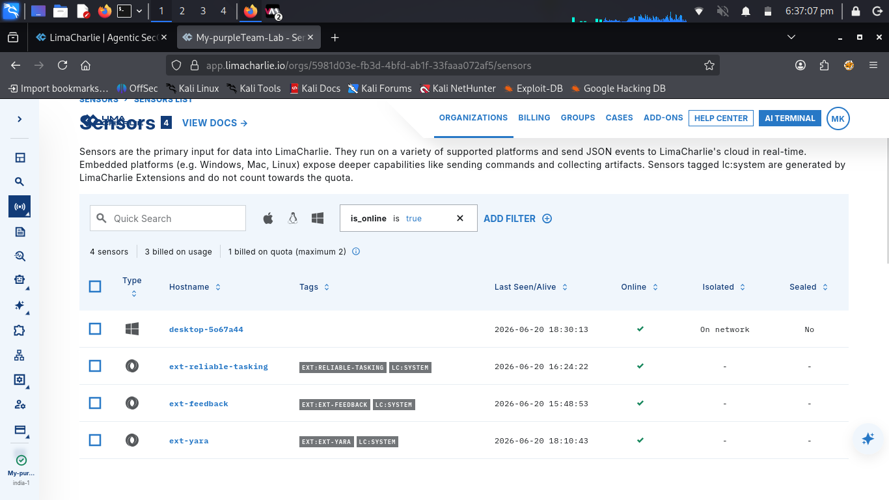
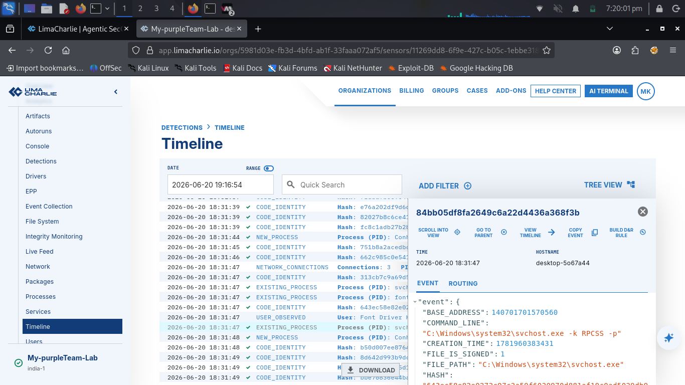
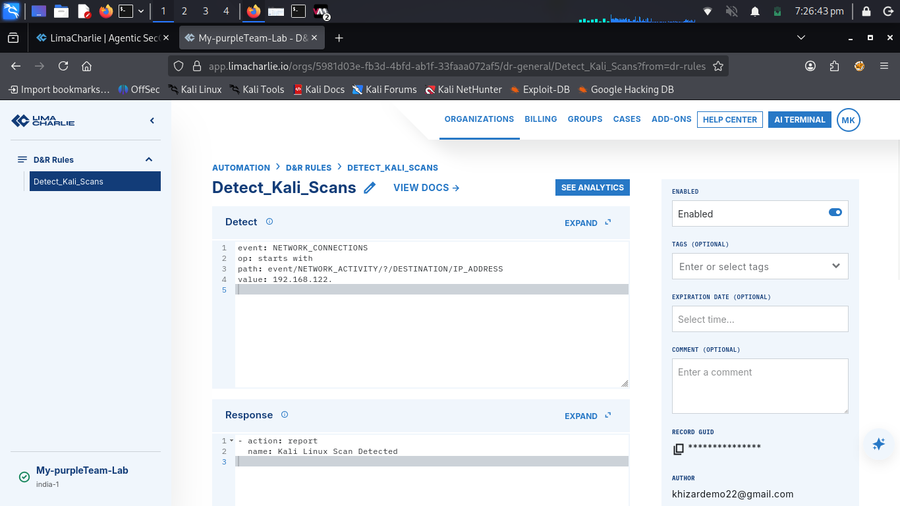
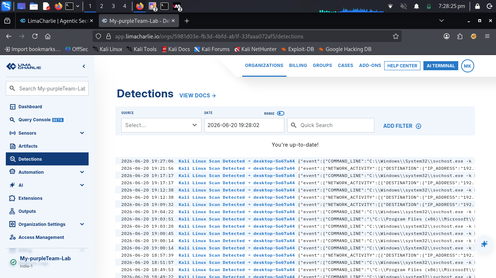

# Purple Team Lab: EDR Onboarding, Reconnaissance Profiling, and Custom Detection Engineering

## Executive Summary
This project outlines the technical implementation, execution, and verification of an end-to-end Purple Team simulation lab designed to capture, visualize, and programmatically detect network reconnaissance signatures. Operating from a bare-metal **Kali Linux** host, structured network scans were targeted against a hardened **Windows 10 Enterprise** guest operating system virtualized natively through **QEMU/KVM**. 

Host-level process behavior and raw socket connections were streamed via an enterprise **LimaCharlie Cloud EDR Sensor**. Utilizing raw telemetry generated during adversarial simulation, a production-grade Detection & Response (D&R) rule was engineered using path-wildcard array parsing. The final iteration successfully eliminated telemetry blind spots and achieved automated real-time alert generation in the cloud console interface.

---

## Technical Architecture & Baseline Specifications
* **Attacker Platform (Host OS):** Kali Linux (Native bare-metal)
* **Hypervisor Environment:** QEMU / KVM 
* **Victim Endpoint (Guest OS):** Windows 10 Enterprise x86_64 (`desktop-5o67a44`)
* **Internal Network Layout:** Isolated QEMU NAT Bridge Subnet (`192.168.122.0/24`)
* **Target Asset IP Address:** `192.168.x.x`
* **EDR Telemetry Engine:** LimaCharlie Cloud Sensor Architecture

---

## Phase 1: Cloud EDR Onboarding & Sensor Deployment
Establishing an uncompromised endpoint telemetry baseline was mandatory prior to triggering adversarial actions. The system onboarding phase followed strict configuration controls:

1. **Tenant Isolation:** Provisioned a dedicated cloud organization tenant space inside the LimaCharlie container ecosystem named `My-purpleTeam-Lab`.
2. **Installation Key Generation:** Navigated to the `Sensors -> Installation Keys` interface and generated a restricted enrollment token designated as `windows target`.
3. **Payload Provisioning:** Acquired the compiled x86_64 standalone executable Windows sensor runtime package (`.exe`) via the integrated console dashboard.
4. **CLI Sensor Deployment:** Staged the installer on the guest machine. Utilizing an elevated Administrative Command Prompt console (`cmd.exe` as Administrator), executed the stealth registration routine using the tenant token:
   
   hcp_windows_x64.exe -i <YOUR_UNIQUE_INSTALLATION_KEY>
   
5. **Enrollment Verification:** Monitored the cloud console to ensure active endpoint telemetry sync. The host machine `desktop-5o67a44` checking in from `192.168.x.x` confirmed successful integration and real-time process monitoring synchronization.

---

## Phase 2: The Attack (Adversary Simulation)
To simulate the initial access and network service discovery phase of an attack lifecycle (**MITRE ATT&CK Framework: T1046 - Network Service Discovery**), an aggressive service identification and rapid port scan sequence was executed from the Kali Linux host terminal interface directly targeting the virtualized subnet node:

   nmap -F 192.168.x.x

---

## Phase 3: Forensic Host Telemetry & Behavioral Analysis
Upon launching the scan array, the LimaCharlie console captured a highly concentrated cluster of endpoint telemetry events over a localized timeframe. A deep forensic audit of the host timeline revealed a distinct behavioral fingerprint:

* **Massive Process Verification (CODE_IDENTITY):** The rapid ingress of socket verification requests on various ports caused the Windows operating system kernel to invoke network stacks, background processes, and system drivers at an accelerated rate.
* **Cryptographic Ingestion:** The EDR sensor intercepted these rapid process invocations on the fly, collecting individual cryptographic SHA-256 process hashes to evaluate system binary validity against live global threat databases.
* **The Forensic Footprint:** This heavy data burst explicitly proves that network-level reconnaissance does not occur in a vacuum; it triggers observable host-level mutations and system artifacts deep within the guest OS kernel and driver structures before an actual exploit is delivered.

---

## Phase 4: Detection Engineering & Rule Optimization
Engineering a high-fidelity detection mechanism required multiple iterations to handle the underlying event logging format used by modern endpoint sensors.

### The Ingestion Hurdle: Array Parsing
Initial rules targeting the standard NETWORK_CONNECTION (singular) event structure failed to fire. Forensic log analysis revealed that during rapid network probes, the endpoint sensor bundles separate connections into an array structure logged under the plural **NETWORK_CONNECTIONS** event type.

Because connection items are grouped inside a variable list named NETWORK_ACTIVITY, fixed path rules like event/NETWORK_ACTIVITY/IP_ADDRESS evaluated as empty. To solve this, a special array wildcard path operator (**/?/**) was implemented, forcing the rule engine to dynamically unpack and evaluate every nested connection entry in the stream.

### Production-Ready D&R Logic Definition

**Detect Block:**
event: NETWORK_CONNECTIONS
op: starts with
path: event/NETWORK_ACTIVITY/?/DESTINATION/IP_ADDRESS
value: 192.168.122.

**Response Block:**
- action: report
  name: Kali Linux Scan Detected

---

## Phase 5: Verification & Operational Proof of Concept
Following rule activation, a secondary validation scan was fired from the Kali Linux host terminal. The detection pipeline executed as engineered:

1. **Log Ingestion:** The Windows endpoint bundled incoming scan traffic into an aggregated NETWORK_CONNECTIONS telemetry packet.
2. **Logic Processing:** The cloud detection engine applied the rule, safely parsed the array using the /?/ path parameter wildcard, and matched the hypervisor bridge prefix string (192.168.122.).
3. **Triage Alert Ingestion:** The engine instantly triggered the response block, outputting a high-fidelity, actionable triage entry titled **Kali Linux Scan Detected** directly inside the organization's central **Detections** console view.

---

## Key Technical Takeaways
* **Enterprise EDR Engineering:** Developed practical, hands-on mastery over endpoint infrastructure enrollment, cryptographic key management, and administrative agent provisioning.
* **Advanced Telemetry Parsing:** Overcame data model blind spots by leveraging complex wildcard array syntax (/?/) to monitor heavily nested telemetry feeds without impacting engine performance.
* **Hypervisor Security Controls:** Utilized low-level, high-isolation Linux QEMU/KVM virtual network bridges to route and capture adversarial traffic safely within a structured lab environment.
